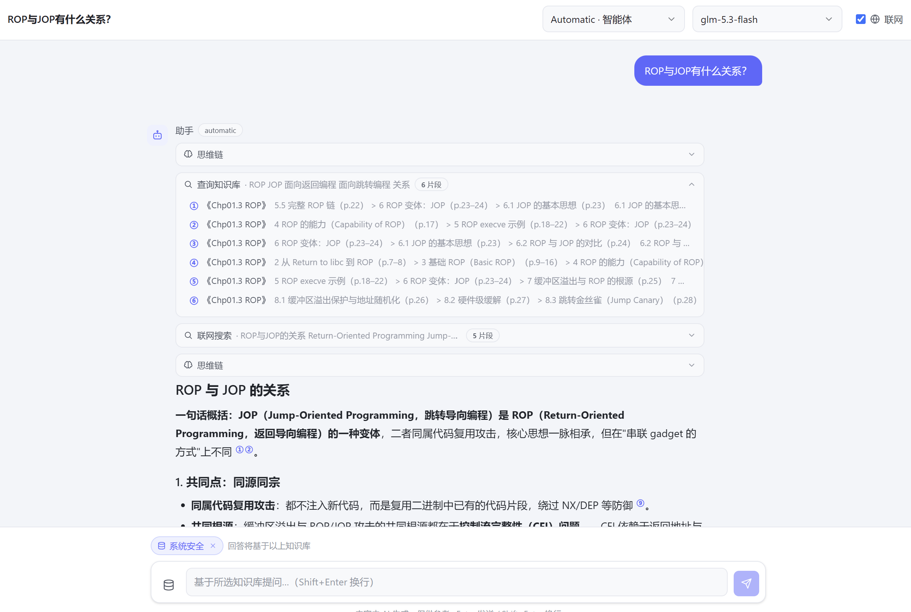
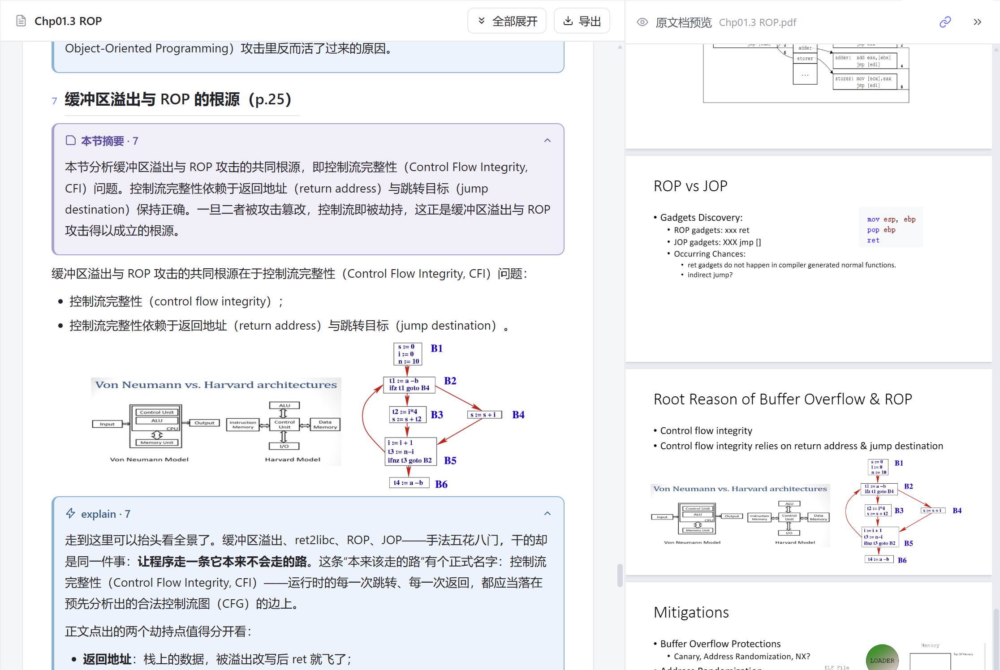
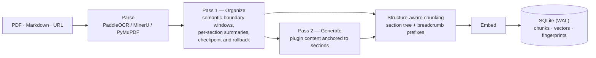
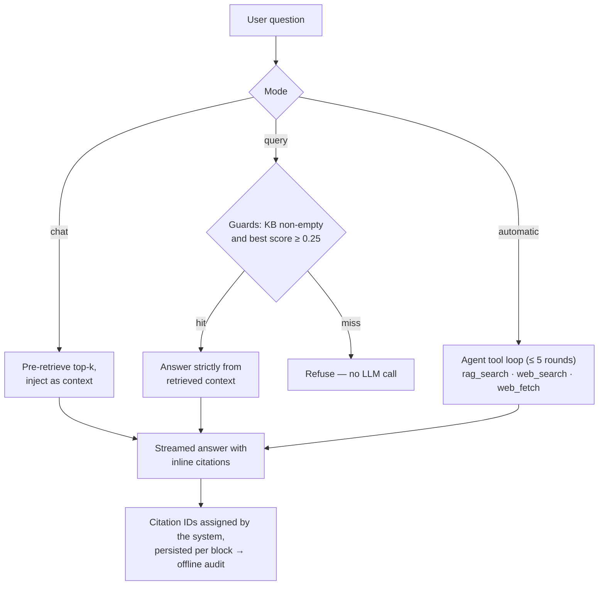

<div align="center">

# Doc-Assistant

**Turn book-length documents into a knowledge base you can converse with.**

*A self-hosted agentic RAG system — two-pass LLM ingestion, structure-aware retrieval, verifiable citations, and a live-rendering web UI.*

[English](README.md) | [简体中文](README.zh-CN.md)

[](README.md#quick-start)
[](README.md#architecture)
[](README.md#architecture)
[](README.md#architecture)
[](LICENSE)



*The assistant in `automatic` mode: it decides on its own whether to search the knowledge base or the web (tool cards, middle), keeps a visible thinking trace, and answers with inline citations — every ① refers to a chunk the system retrieved and numbered itself.*

</div>

## Why

Book-length documents break RAG in three specific ways. Doc-Assistant is built around answering each of them:

| Pain point | Doc-Assistant's answer |
|---|---|
| A 1,000-page textbook doesn't fit any context window, and naive sliding-window processing destroys its structure | **Two-pass ingestion.** The LLM reconstructs the document's section tree in semantic-boundary windows; per-section summaries replace raw text as the rolling inter-window context. A 3.4M-character textbook was processed in 10 windows of ~100K tokens, with inter-window context bounded at ≤30K tokens. |
| Fixed-length chunking retrieves fragments with no hierarchical context | **Structure-aware chunking.** Index units are the LLM-reconstructed numbered sections — with breadcrumb path prefixes, adaptive splitting of over-long sections and merging of over-short ones — not fixed-size slices. |
| Static RAG injects a fixed top-k and cannot decide *what* to fetch, *when* | **Agentic retrieval with progressive disclosure.** The generation agent navigates a document digest → table of contents → section summaries → vector search, so per-document context stays ~O(1) instead of growing with the knowledge base. |

## Features

| | Feature | What you get |
|---|---|---|
| 📚 | **Knowledge-base management** | Two-level KB/document organization with batch operations and drag sorting; upload PDF/Markdown (parsed on upload); import web pages by URL; move/copy documents across KBs with zero re-computation of artifacts and vectors. |
| ⚙️ | **Two-pass ingestion pipeline** | Three OCR engines (PaddleOCR cloud / MinerU cloud / local PyMuPDF); **Pass 1** reorganizes the raw text into numbered, structured notes and produces per-section summaries, a TOC, and a document digest in a single streaming call; **Pass 2** generates plugin content (detailed explanations, exercise solutions, paper analysis…) anchored to sections. Organizing presets are editable, with A/B variants kept side by side. |
| 🧭 | **Agentic retrieval, three modes** | `chat` — free conversation with KB context injected; `query` — strict KB-only with explicit refusal on a miss; `automatic` — the agent decides on its own whether to call `rag_search` or web tools, within a bounded loop (≤5 rounds). Mode semantics follow AnythingLLM's chat/query/automatic design. |
| 🪜 | **Progressive disclosure** | Before deep retrieval, the generation agent sees one digest line per document; it then pulls the TOC or per-section summaries on demand, and only then searches fragments. Injected context stays bounded as the KB grows. |
| 📎 | **Verifiable citations** | Citation numbers are **assigned by the system** to retrieved chunks and persisted as per-block reference metadata; the model marks them with a `[[c:N]]` protocol rendered as inline ①. Hover for a source preview; click to jump to the exact PDF location (web sources open in a new tab). Every citation is **auditable offline**. |
| 🛡️ | **Reliability engineering** | Parameter-fingerprint idempotency (skip / resume / fresh), checkpoint–rollback recovery on context overflow, graceful tool-failure degradation, refusal guards, and an SSE delivery layer with a snapshot ≡ replay watermark invariant. See [Reliability](#reliability). |
| 🖥️ | **Live-rendering web UI** | Character-level streaming markdown rendering (zero loss, zero jank); **dual-window synced scrolling** between generated notes and the source PDF via page-number anchors; render snapshots for instant reopen; session branching from any message; keep-alive tabs with cross-restart scroll memory; callout-style folding; export to Markdown/PDF; KaTeX; @-mention a KB; dark/light themes; deep links to any document, session, or scroll position. |
| 🌐 | **Web search** | Four interchangeable providers (Tavily / Exa / ExamCP / Jina — one is keyless), available to the assistant and to content generation, with graceful degradation when a provider fails. |

<div align="center">


*Generated notes (left) and the source PDF (right) stay in sync by page anchors — including while generation is still streaming.*
</div>

## Architecture





Everything runs in one FastAPI process over a single SQLite database (WAL mode) — no external vector DB, no message queue. The web layer (`backend/app`) talks to a pipeline core (`backend/engine`) through a versioned API contract; two SSE channels carry global events and the chat stream.

## Reliability

Doc-Assistant is organized around the failure modes I actually hit while running it. For every class of failure, there is an engineered mitigation:

| Failure mode | What actually happened | Mitigation |
|---|---|---|
| **Context overflow** | An ingestion window exceeded the model's context limit mid-run | **Checkpoint–rollback**: locate the recovery point by the last complete section summary + page marker, keep consumed page blocks, halve the remaining window, retry recursively (depth ≤ 3) |
| **Tool failure** | Tool exceptions; a model without tool-call support | Exceptions degrade to error text fed back to the model (the pipeline survives); auto-fallback to plain generation when the model can't use tools; unsupported API parameters dropped and retried |
| **Unbounded autonomy** | The agent could loop on tools indefinitely | Round budget (≤ 5), then a system notice and tools disabled |
| **Hallucinated grounding** | The generation agent inventing document IDs | Runtime whitelist validation of document IDs; `[[c:N]]` citation protocol with system-assigned IDs, persisted for offline audit |
| **State corruption** | Pipeline interrupted / restarted mid-run; artifacts drifting from parameters | Parameter-fingerprint idempotency (prompts sha / artifacts sha / composition / model → skip / resume / fresh), `.state/` breakpoints, automatic `.backup/`, invalidation-chain propagation, atomic writes |
| **Delivery failure** | SSE races → character gaps and duplicates; zombie subscriptions | Drop-stale-keep-new **plus critical-event-must-deliver**; zombie reclamation; reconnect dedup; **watermark invariant** (snapshot ≡ ordered event replay, same-lock atomic) |
| **Overconfidence** | Answering anyway when the KB is empty or retrieval misses | **Refusal guards**: empty KB / empty retrieval → refuse without invoking the LLM; 0.25 similarity threshold |

> **Design principle:** push work into *verified workflows* wherever possible (fixed stages, fingerprints, checkpoints); where autonomy is necessary, wrap it with budgets, degradation paths, and runtime-checked invariants.

## Quick Start

**Requirements:** Python ≥ 3.10, Node.js ≥ 18. No `.env` file, no external services — the backend starts with zero configuration and creates its SQLite database on first run.

```bash
# 1) Backend — FastAPI, listens on 127.0.0.1:8000
cd backend
python -m pip install -r requirements.txt
python run_server.py

# 2) Frontend (dev) — Vite on localhost:5173, /api proxied to 127.0.0.1:8000
cd webui
npm install
npm run dev

# Production instead: npm run build → the backend auto-serves webui/dist
```

**First run (in the web UI, Settings page):**
1. Add an OpenAI-compatible provider (base URL + API key), pull the model list.
2. Assign the six model slots: assistant · organize · generate · auxiliary · embedding · rerank (only an assistant model + an embedding model are strictly needed).
3. Pick an OCR engine for PDF parsing (cloud PaddleOCR / cloud MinerU / local PyMuPDF) — local works with no key.
4. Optionally configure a web-search provider (Tavily / Exa / ExamCP / Jina).
5. Create a knowledge base, upload a PDF/Markdown file (or paste a URL) — ingestion starts immediately and streams live.

> Note: the UI is currently Chinese-only.

## Usage

Pick a mode per conversation (or switch mid-session):

| Mode | Use it when | Behavior on a retrieval miss |
|---|---|---|
| `chat` | Open-ended discussion, brainstorming around your material | Answers from model knowledge, clearly grounded in injected context when available |
| `query` | Facts you expect to be **in** the KB; exam prep | **Refuses explicitly** — no guessing |
| `automatic` | You don't know whether the answer is in the KB, or it needs both KB + web | The agent searches, re-searches, or goes to the web on its own (≤ 5 rounds), citing as it goes |

- **@-mention** a knowledge base to bind the conversation to it; **branch** from any message to explore a different line of questioning without losing the original.
- Inline ① markers hover-open a source preview and click-through to the exact PDF page — or the live web page.
- Export any generated document to Markdown (instant) or PDF (configurable page size, orientation, columns, margins, font size).

## Repository Layout

```
backend/
  app/        Web layer — routers, services (chat / generate / index / kb / settings),
              RAG (chunker · embeddings · vectorstore · retriever · rerank),
              liveview (character-level stream state machine + authoritative render tree)
  engine/     Pipeline core — llm, pass1/pass2 windowing with checkpoints, OCR,
              block protocol, prompt kit, export
  prompts/    Organizing & generation presets (textbook / courseware / article / …)
  tests/      pytest suite (SSE delivery, page anchors, resume, …)
  data/       Runtime data — SQLite app.db, artifacts, exports (gitignored)
webui/        React 18 + Vite + TypeScript + Zustand + Tailwind
docs/         README assets
```

## Documentation

The project's internal design docs (global design, REST + SSE API contract, module-level guides, ADRs, full-chain test logs) are part of the private development workflow and are not part of this public repository — this README is the complete public documentation.

## Testing

```bash
cd backend
python -m pytest
```

The suite covers the SSE delivery layer — its **watermark invariant** requires any client snapshot to equal the ordered replay of events — plus page-anchor alignment between generated notes and the source PDF, and checkpoint-resume of interrupted ingestion runs.

## License

[MIT](LICENSE) © 2026 Tchipsier

---

<div align="center">

Built by **Tchipsier**

</div>
