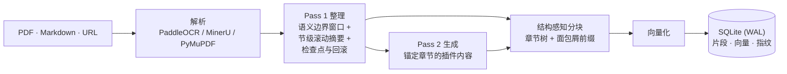
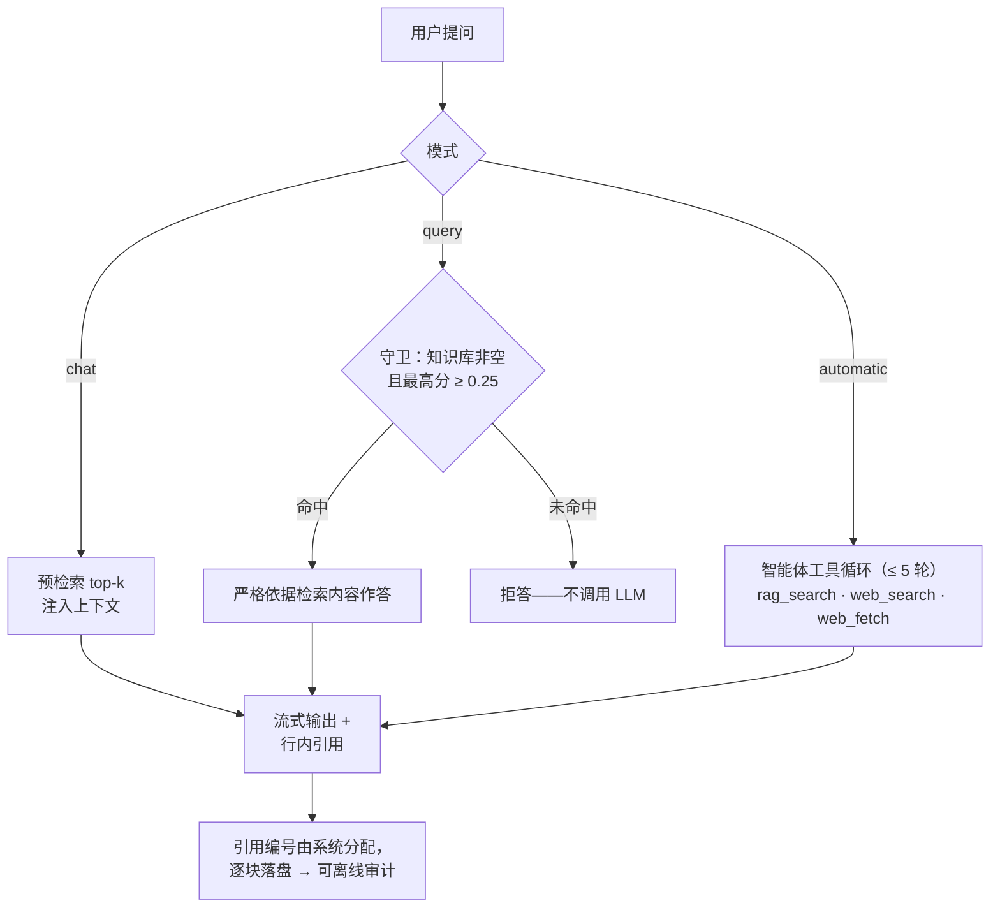

<div align="center">

# Doc-Assistant

**把整本教材变成可以对话的知识库。**

*自托管的 agentic RAG 系统——两阶段 LLM 整理入库、结构感知检索、可校验引用、实时渲染的 Web 界面。*

[English](README.md) | [简体中文](README.zh-CN.md)

[](README.zh-CN.md#快速开始)
[](README.zh-CN.md#架构)
[](README.zh-CN.md#架构)
[](README.zh-CN.md#架构)
[](LICENSE)


*`automatic` 模式下的助手：自主决定查知识库还是联网（中间为工具卡片），保留可见的思维链，回答带行内引用——每个 ① 都指向系统自己检索并编号的片段。*

</div>

## 为什么做这个

超长文档会以三种特定方式击穿 RAG。Doc-Assistant 的设计就是逐条回应它们：

| 痛点 | Doc-Assistant 的回答 |
|---|---|
| 1000 页的教材塞不进任何上下文窗口，朴素的滑窗处理还会破坏文档结构 | **两阶段入库。** LLM 在语义边界窗口内重建文档的章节树；节级摘要替代原始文本作为滚动窗口间上下文。实测 342 万字符教材用 10 个 ~10 万 token 窗口处理完，窗口间上下文压在 ≤3 万 token。 |
| 定长分块检索回来的是没有层级语境的碎片 | **结构感知分块。** 索引单元是 LLM 重建的编号章节——带面包屑路径前缀，超长节自适应切分、过短节向父节合并——而不是固定大小的切片。 |
| 静态 RAG 固定注入 top-k，无法决定"什么时候检索什么" | **渐进披露式的 agentic 检索。** 生成侧智能体按"每篇一行概况 → 目录 → 节级摘要 → 向量检索"逐层导航，单篇注入的上下文保持 ~O(1)，不随知识库规模膨胀。 |

## 功能

| | 功能 | 你能得到什么 |
|---|---|---|
| 📚 | **知识库管理** | 知识库/文档两级组织，批量操作与拖拽排序；上传 PDF/Markdown（上传即解析）；粘贴网址导入网页；跨库移动/复制文档，产物与向量零重算带走。 |
| ⚙️ | **两阶段入库流水线** | 三种 OCR 引擎（PaddleOCR 云 / MinerU 云 / 本地 PyMuPDF）；**Pass 1** 在单次流式调用里把原稿整理成编号规范的讲义，同时产出每节摘要、全文目录与文档简介；**Pass 2** 在章节锚点生成插件化内容（详细讲解 / 作业解答 / 论文解析…）。整理预设可自编，试验变体 A/B 并存。 |
| 🧭 | **agentic 检索三模式** | `chat`——注入知识库上下文的自由对话；`query`——仅限知识库的严格回答，检索不到明确拒答；`automatic`——智能体自主决定调用 `rag_search` 还是联网工具，循环有上限（≤5 轮）。三模式语义参照 AnythingLLM 的 chat/query/automatic 设计。 |
| 🪜 | **渐进披露** | 深检索之前，生成侧智能体先看到每篇文档一行的概况；按需拉取目录或节级摘要；最后才检索具体片段。知识库变大，注入上下文不跟着膨胀。 |
| 📎 | **可校验引用** | 引用编号由**系统分配**给检索到的片段，以块级引用元数据落盘；模型按 `[[c:N]]` 协议标注，渲染为行内 ①。悬停显示出处预览浮卡，点击跳到 PDF 精确位置（网页来源开新标签页）。每条引用都可**离线审计**。 |
| 🛡️ | **可靠性工程** | 参数指纹幂等（skip / resume / fresh 三态）、上下文溢出检查点-回滚、工具失败优雅降级、拒答守卫、SSE 投递层的"快照 ≡ 事件重放"水位线不变式。见[可靠性](#可靠性)。 |
| 🖥️ | **实时渲染 Web 界面** | 字符级流式 Markdown 渲染（零丢失、零闪跳）；生成讲义与原文 PDF **双窗口同步滚动**（页码锚点）；渲染快照秒开；从任意消息分支新会话；多标签 keep-alive、滚动位置跨重启记忆；callout 风格折叠；导出 Markdown/PDF；KaTeX 公式；@提及知识库；亮暗主题；深链直达任意文档、会话与位置。 |
| 🌐 | **联网搜索** | 四个可切换服务商（Tavily / Exa / ExamCP / Jina——其一免密钥），助手与内容生成都可用，服务商故障时优雅降级。 |

<div align="center">


*左侧生成讲义与右侧原文 PDF 按页码锚点保持同步——生成仍在流式进行时同样生效。*
</div>

## 架构





整个系统跑在一个 FastAPI 进程 + 一个 SQLite 数据库（WAL 模式）里——没有外部向量库，没有消息队列。Web 层（`backend/app`）通过带版本的 API 契约调用流水线核心（`backend/engine`）；两条 SSE 通道分别承载全局事件与对话流。

## 可靠性

Doc-Assistant 是围绕真实运行中踩到的失效模式组织的。每一类失效都有对应的工程化缓解：

| 失效类别 | 真实发生的 | 缓解机制 |
|---|---|---|
| **上下文溢出** | 整理窗口运行中超出模型上下文限制 | **检查点-回滚**：按最后一个完整节摘要 + 页标记定位恢复点，保留已消费页块，剩余窗口减半，递归重试（深度 ≤ 3） |
| **工具失效** | 工具执行异常；模型不支持工具调用 | 异常降级为错误文本回灌模型（流水线不断）；模型不支持工具时自动回退普通生成；不支持的 API 参数剔除后重试 |
| **越界自主** | 智能体可能在工具循环里无限打转 | 轮数预算（≤ 5），超限注入系统提示并禁用工具 |
| **幻觉接地** | 生成智能体编造文档 ID | 文档 ID 运行时白名单校验；`[[c:N]]` 引用协议 + 系统分配编号，落盘可离线审计 |
| **状态损坏** | 流水线中断/重启；产物与参数漂移 | 参数指纹三态幂等（提示词 sha / 产物 sha / 组成 / 模型 → skip / resume / fresh）、`.state/` 断点、自动 `.backup/`、失效链传播、原子写入 |
| **投递失效** | SSE 竞态 → 字符空洞与重复；僵尸订阅 | 丢旧保新 **+ 关键事件必达**；僵尸订阅回收；重连去重；**水位线不变式**（快照 ≡ 按序重放事件，同锁原子） |
| **过度自信** | 知识库为空或检索未命中时仍然硬答 | **拒答守卫**：库空 / 检索为空 → 不调用 LLM 直接拒答；0.25 相似度阈值 |

> **设计原则**：能进"验证过的工作流"的（固定阶段、指纹、检查点），就不要交给自主循环；必须自主的部分，用预算上限、降级路径、运行时不变式包起来。

## 快速开始

**环境要求**：Python ≥ 3.10、Node.js ≥ 18。没有 `.env` 文件、不依赖外部服务——后端零配置启动，首次运行自动建 SQLite 数据库。

```bash
# 1) 后端——FastAPI，监听 127.0.0.1:8000
cd backend
python -m pip install -r requirements.txt
python run_server.py

# 2) 前端（开发）——Vite 跑在 localhost:5173，/api 代理到 127.0.0.1:8000
cd webui
npm install
npm run dev

# 生产形态：npm run build → 后端自动托管 webui/dist
```

**首次使用（在网页的设置页里）：**
1. 添加 OpenAI 兼容服务商（API 地址 + 密钥），拉取模型列表。
2. 分配六个模型槽：助手 · 整理 · 生成 · 辅助 · 嵌入 · 重排（严格必需的只有助手模型 + 嵌入模型）。
3. 选 PDF 解析的 OCR 引擎（云 PaddleOCR / 云 MinerU / 本地 PyMuPDF）——本地引擎无需密钥。
4. （可选）配置联网搜索服务商（Tavily / Exa / ExamCP / Jina）。
5. 新建知识库，上传 PDF/Markdown（或粘贴网址）——入库立即开始并实时流式展示。

> 说明：界面目前仅有中文。

## 使用

每个会话选择一种模式（也可中途切换）：

| 模式 | 什么时候用 | 检索未命中时 |
|---|---|---|
| `chat` | 围绕材料的开放式讨论、头脑风暴 | 用模型知识回答（有注入上下文时会明确依托） |
| `query` | 你确定答案**在**知识库里的问题；备考 | **明确拒答**——不瞎猜 |
| `automatic` | 不确定答案在不在库里，或需要"库内 + 联网"组合 | 智能体自己检索、换词重检或转向联网（≤ 5 轮），边查边引用 |

- **@提及**知识库把会话绑定到它；从任意消息**分支**新会话，在不丢原会话的前提下换一条追问路线。
- 行内 ① 悬停打开出处预览浮卡，点击直达 PDF 精确位置——或网页原文。
- 任何生成文档可导出 Markdown（秒出）或 PDF（纸张/方向/栏数/边距/字号可调）。

## 仓库结构

```
backend/
  app/        Web 层——routers、services（chat / generate / index / kb / settings）、
              RAG（chunker · embeddings · vectorstore · retriever · rerank）、
              liveview（字符级流式状态机 + 权威渲染树）
  engine/     流水线核心——llm、pass1/pass2 窗口化与检查点、OCR、
              块协议、提示词工具箱、导出
  prompts/    整理与生成预设（教材 / 课件 / 文章 / …）
  tests/      pytest 套件（SSE 投递、页锚点、断点续传等）
  data/       运行时数据——SQLite app.db、产物、导出（gitignored）
webui/        React 18 + Vite + TypeScript + Zustand + Tailwind
docs/         README 配图
```

## 文档

项目的内部设计文档（全局设计、REST + SSE API 契约、模块级指南、ADR、全链路测试日志）属于私有开发工作流，不包含在本公开仓库中——本 README 即全部公开文档。

## 测试

```bash
cd backend
python -m pytest
```

套件覆盖 SSE 投递层——其**水位线不变式**要求客户端任意快照必须等于按序重放事件——以及生成讲义与原文 PDF 的页锚点对齐、中断入库的检查点续跑。

## 许可证

[MIT](LICENSE) © 2026 Tchipsier

---

<div align="center">

Built by **Tchipsier**

</div>
